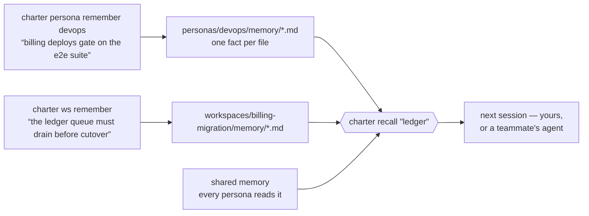
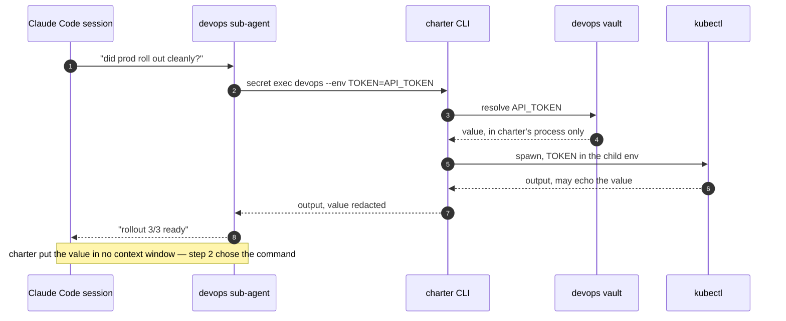

# charter

> [!IMPORTANT]
> **charter is now a desktop app: [diazoxide/charter-app](https://github.com/diazoxide/charter-app).**
> This Python package (`charter-cp`) is deprecated and receives no further releases. The app is
> charter from 0.1.0 on: one window for your projects, workspaces and chats, with its own
> `charter` command and Claude Code plugin built in, and nothing to install from PyPI. It reads
> the planes you already have as they are. Download it from the
> [latest release](https://github.com/diazoxide/charter-app/releases/latest).
>
> This repository stays as it is, as history and as a working control plane. What follows
> describes the Python charter.

[](https://pypi.org/project/charter-cp/)
[](https://pypi.org/project/charter-cp/)
[](https://github.com/diazoxide/charter/actions/workflows/test.yml)
[](LICENSE)

**Your agent forgets everything, holds every credential, and works in one checkout.**

![charter's frame on a demo plane: an identity row naming the workspace billing-migration, the persona devops and its vault; a strip of four workspace tabs, two of them with a chat count; a strip of three chats, the current one highlighted and another carrying one frame of its working spinner, ending in a plus and a minus; the middle pane, where the harness runs, showing the output of charter status rather than an agent; beside it a persona column with a running-dispatch badge and the workspace's two todos; the repo table underneath with each repo's branch, dirty and unpushed markers, CI result and pull request number; and a bottom row counting todos and running work.](docs/assets/frame-full.svg)

charter is a control plane for coding agents working across many repos on GitHub or
GitLab: durable **personas**, isolated per-task **workspaces**, and a credential **vault**
the model never reads from. It runs inside **Claude Code, opencode and Codex**, enforcing
the same rules in each.

That picture is **the frame**, which charter draws around your agent. `charter claude`
— or `charter opencode`, or `charter codex` — starts the harness inside a tmux window charter
lays out: the agent in the middle, charter's panels around it, repainted when charter's
hooks say the plane changed. tmux draws the rectangles and does the terminal emulation;
charter fills the edges and draws nothing in the agent's own pane (ADR 0018). It is a
capture, not a mockup: `docs/assets/capture-frame.sh "$(mktemp -d)" --full` empties the
directory it is given, builds a throwaway plane in it, opens four chats on a private tmux
server and prints the screen. **No agent is running in it.**
Every chat runs `charter status`, which is what fills the middle pane, and the CI results,
the dispatch badge and the working mark are files the capture scripts write in the shape
charter's own writers leave them.

**What the picture shows that your frame may not.** Neither tab strip is drawn until the
plane places it with a `[[frame.component]]` table: on a plane with one chat, a strip is a
row taken off your harness to show a name `F2` reaches in two keystrokes
([docs/frame.md](docs/frame.md#the-two-bars-and-why-they-are-off-unless-you-ask)). The `✢` in
front of `billing-migration.1` is one frame of a working chat's spinner, not a second current
chat; the current chat is the highlighted one, marked `*`. That spinner comes from Claude
Code's `UserPromptSubmit` and `Stop` hooks, so a chat running opencode or Codex never shows
one, and a turn you interrupt with Esc keeps spinning until ten minutes pass with no tool
call.

**Charter no longer writes a status line into Claude Code** (#895). Until 0.57.0 `charter
init` put a `statusLine` key in `.claude/settings.json`; it leaves that key alone now, and a
plane that already had one keeps it. The command that key ran stays, for two jobs the frame
does not do: `charter statusline --watch` repaints the plane in any spare terminal — beside a
harness run with `--no-frame`, or on a machine with no tmux — and opencode's `/charter` pipes
the same render into the agent's own context, which a panel cannot, because the model never
reads a panel's pane. What went with the key is the context gauge: Claude Code hands its
token usage to a `statusLine` command and to no hook, so the frame draws no `ctx`/`cache`
figure unless you wire that key back yourself.

## 60 seconds


```bash
uv tool install charter-cp

mkdir my-control-plane && cd my-control-plane
charter init --forge github --owner my-org
charter doctor
charter discover
charter clone some-repo
charter claude            # or charter opencode, or charter codex
```

**One command installs charter, and `charter init` installs Claude Code's half.** `uv tool
install charter-cp` puts the `charter` CLI on your `PATH` — a single machine-global install,
what you type in your own terminal and what CI or a cron job runs. `charter init` then
installs charter's Claude Code plugin **for that plane**, at project scope, out of a cache
Claude Code keeps holding every version at once, which is why a *plane's* pinned version is
the plugin's and not the binary's: two planes on one laptop can sit on different charters
without fighting. The plugin ships no Python of its own — every hook it declares shells out
to the CLI, which is why the CLI is the thing you install and the plugin is the thing it
installs for you. With no `claude` on your `PATH`, `init` installs no plugin and prints no
row for one: an opencode or Codex plane has none to be missing.
→ **[docs/install.md](docs/install.md)**

**Already have a plane?** `charter doctor` names a missing plugin on its `plugin install`
row, and `charter doctor --fix` installs it. The plugin loads at the **next** Claude Code
session, after `init` and `--fix` alike, so restart any session that was already open.

**The recording stops before `charter claude`**, because the frame is a full-screen tmux
client and `capture-demo.sh` records a line transcript; the picture at the top of this page
is what that step opens. `charter claude` needs `claude` on your `PATH` — a profile needs
whatever its command names, a wrapper like `ccs work` included: without it no frame is
drawn, and charter says the program is not installed and exits 127. The frame also needs
tmux, and of tmux only its absence stops a launch — below 3.2, the version charter checks
its requirements against, the frame still starts. `charter opencode` and `charter codex`
need their own binaries the same way, and `charter claude --probe` says whether a frame can
run here without starting one.

`charter` on its own opens a chat at the **profile selector** and starts nothing until you
pick a row — charter does not pick a harness for you, it asks. `init` writes no `[harness]
default`; add one to `charter.toml` and it is the row the cursor starts on:

```toml
[harness]
default = "claude"
```

The value names a **profile** — `claude`, `codex` and `opencode` are the built-in one per
harness, and `charter.local.toml` is where you declare your own (a pinned version, a second
account); see [control-plane.md](docs/control-plane.md#harness--profiles-and-the-default).

Piped anywhere, bare `charter` prints its usage instead of opening a frame.

- **`charter init`** scaffolds `charter.toml`, the baseline directories (`personas/`,
  `inventory/`, `workspaces/`), a `.gitignore` tuned for the layout, and Claude Code's
  charter plugin for this plane. Additive and idempotent — re-running it
  is always safe. It converts *the directory it runs in* into a control plane, so run it
  somewhere you mean to.
- **`charter doctor`** preflights python, git, git identity, the forge CLI and its auth, and
  whether a frame can run, and names what's missing before anything else trips over it.
  `--fix` installs the pieces charter can install; without it `doctor` installs nothing.
- **`charter discover`** queries the forge through `gh` or `glab`, which nothing above
  installs and which must be authenticated, and writes `inventory/repos.json` — the tracked
  map of every repo in the org, complete even when nothing is cloned yet.
- **`charter clone <repo>`** clones on demand into the active workspace with that forge
  CLI's token over HTTPS, already carrying the one-credential git policy below.
- **`charter claude`** opens a chat in the frame. Closing the terminal detaches and leaves
  the harness running; `F2` → `charter: quit` stops every chat on the plane and records
  them first, and `charter reopen` — or bare `charter` when nothing is running — puts them
  back on their own profiles, resuming the conversation wherever Claude Code recorded one.

## You don't need charter if

- You work in **one repo**, on **one task at a time**.
- Your agent touches **no credential** you'd mind seeing in a transcript.
- Nothing it works out in a session is worth having **next week**.

Any one of those and charter is setup with nothing to show for it. If two or three of them
made you wince, keep reading — each section below is a failure that happened often enough
to get built around.

---

## Dozens of repos, several tasks in flight, one checkout

A team's work doesn't sit in one repository, and an engineer rarely has one task open. Two
features and a hotfix means three sets of branches across a shifting set of repos, and if
they share a checkout you spend the day stashing.


A **workspace** is one directory of clones per task (`workspaces/<task>/<repo>`), each repo
on its own branch. Moving between tasks is `charter workspace use <name>` in a terminal, or
`F2` → `workspace` inside the frame, which moves your terminal to that workspace and leaves
every chat in the one you left running. Nothing follows you across — no stash, no context
bleed, no half-applied branch from yesterday.

**Two sub-agents that need the same repo** is the case that breaks everything else.
Cloning it twice wastes the disk and they still collide. A **worktree** splits one clone
into several checkouts (`.worktrees/<repo>/<piece>`), a branch each, so the pieces
genuinely run at the same time. `charter worktree remove` refuses if it would drop
uncommitted or unpushed work.

**A workspace carries its own intent.** Claude Code's task list dies with the session;
`charter ws todo` records what the task still means to do, and each workspace holds a
one-line **Vision** that a fork inherits.

**And it travels.** `charter workspace snapshot` writes repos and branches into a committed
manifest, `restore` rebuilds the whole thing on another machine, and `fork` copies a
workspace's charter, manifest and memory. A workspace marked **LIVE**
(`charter workspace live`) commits its manifest and memory, so several engineers can work
the same task and share what each session learned. Workspaces are `local` — fully private,
nothing committed — until you say otherwise.

**Its own repo, or yours.** A control plane is any directory holding `charter.toml`, so it
can be a dedicated repo — a monorepo *for* your polyrepo — or `charter init` inside the
monorepo you already have, which offers to clone that repo into `workspaces/default/`.
Either way work happens in the workspace clones, **never in the plane root**: two sessions
sharing one working tree thrash each other's branches, so `charter doctor` and `charter
statusline` warn when the plane root is dirty or off its default branch.
→ [docs/workspaces.md](docs/workspaces.md)

---

## One agent holding every credential and every context

A single agent carrying every token, every convention and every repo's history is both a
security problem and a quality one — it has access it doesn't need for the task in front of
it, and a context full of things that don't apply.


A **persona** is a small named scope with its own charter, its own committed memory, its own
vault, and a `delegate-when` line saying what should be handed to it. `charter persona
sync-agents` turns each one into a real Claude Code sub-agent, so dispatching a role is
ordinary delegation rather than a prompt trick. A persona whose `mcp.json` hands a vault
value to a server names the destination it would reach and waits for `--approve-mcp`, which
asks about each server after showing it. What gets recorded is a digest of the line you
read — which names every key of the entry and the vault it would spend, not only the
server's name — so a teammate re-pointing any of it lapses the approval rather than
inheriting it.

They compose the way people do: `extends:` inherits a parent's charter, `uses:` says this
role routes work to that one, and `agent-tools` narrows what the generated sub-agent may
touch. They are committed files, so a persona is a team artifact — your `reviewer` is your
teammate's `reviewer`.
→ [docs/personas.md](docs/personas.md)

---

## Two accounts, a pinned version, a wrapper — and a harness nobody picked

`charter claude` ran one program, one way: `claude` from your `PATH`, on whichever account
its config folder held. A second subscription, a Codex pinned to an older release, or a
wrapper like `ccs work` had no way in — and every new chat started a harness before you had
said which one you wanted.

A **harness profile** is that way in: a kind, a command and an environment, declared in
`charter.local.toml` beside `charter.toml` — a file charter keeps out of git, because a
profile's command runs on a click.

```toml
[harness.claude-work]
kind = "claude"
command = ["claude"]
env = { CLAUDE_CONFIG_DIR = "~/.claude-work" }

[harness.claude-ccs]
kind = "claude"
command = ["ccs", "work"]
```

- **Nothing starts until you pick.** A new chat — bare `charter`, the `+`, a workspace tab —
  opens at the **profile selector** in its own pane: every profile, with why any cannot
  start on its row. Enter runs it; Esc closes the chat, having started nothing.
- **A new or changed command asks once.** The first time a profile you declared runs, and
  again whenever its command or environment changes, charter shows exactly what will run
  and asks `run this? [y/N]`. The file is one a chat can write; the question is what stands
  for your approval. Built-ins never ask.
- **A config folder without charter's guard is wired before the chat starts.** A second
  `CLAUDE_CONFIG_DIR` has none of the first one's plugins, so a chat there would look
  guarded and not be. charter asks the harness itself, installs its plugin into that folder,
  says so in one line — `wired 'claude-work' — installed charter@charter into
  ~/.claude-work` — and starts the chat only once the harness answers *wired*. Codex is the
  exception: its hooks are trusted only inside a Codex session, so charter writes its part
  and prints Codex's own steps instead of starting. `charter doctor` gains a row per profile.
- **Every chat remembers its profile.** The `+`, a handoff and `charter reopen` bring a chat
  back on the same profile — the same account — not merely the same harness.

`charter harness list` shows every profile charter read, where each came from, and why any
was refused.
→ [docs/harnesses.md](docs/harnesses.md#two-accounts-of-one-harness-or-one-version-pinned) ·
[docs/control-plane.md](docs/control-plane.md#harness--profiles-and-the-default)

---

## You are always teaching the agent the same things

`CLAUDE.md` holds what you sat down and wrote. It doesn't hold what the agent worked out at
2am — that the flaky checkout test is a DNS timeout rather than the code, that billing
deploys gate on the e2e suite and not the unit ones. That knowledge dies with the session,
so next week you explain it again or watch it get rediscovered the slow way.



Memory has three dimensions and they do different jobs: **a persona's own** (what this role
knows), **shared** (what every role should know), and **the workspace's** (what this task
established). One fact per markdown file.

`charter recall` searches all three in a single pass — by keyword, or with `--since 2w` and
`--all-workspaces` for when you remember roughly *when* something was decided but not where
or in what words. They are ordinary files, so how far a note travels — disk only,
committed, or pushed to the team — is one setting, `[memory].share`, and it defaults to
`local`.

---

## Credentials that end up in the transcript

The moment an agent reads a token, that token is in the context window — and from there in
the transcript, the logs, and any summary fed into a later prompt. A **vault** hands the
value to a *command* instead of to the model:



Reads are masked by default, `--reveal` refuses a non-interactive stdout, and the plugin's
guard denies that flag and known reader programs whose argument spells out a vault path.
Those close the accidental paths; they are not a boundary against a command chosen on
purpose — a glob, a shell variable or an unlisted program walks past, by design and not by
oversight — see [SECURITY.md](SECURITY.md).

**Vaults are pluggable, and the provider is where the storage guarantee comes from.** Three
ship today — `plain_file`, `reference` (point at a value that lives elsewhere) and
**`1password`** — and more are coming. Read [docs/secrets.md](docs/secrets.md) before
storing anything real: **`plain_file` is plaintext at mode 0600, with no encryption at
rest.** What every provider buys you is the same and it is the point — on the paths that
consume it (`secret exec`, `--dotenv`, MCP) ***charter never prints the value into the
conversation, and everywhere else prints it only where you asked for it yourself***. What
the command you hand it to does with it is that command's business — and `secret get
--reveal` prints to your terminal, while `secret cp` writes a real file it creates and
refuses any destination that turns out to be one of charter's own streams, `/dev/stdout`
included ([#449](https://github.com/diazoxide/charter/pull/449)). What only a real
backend buys you is encryption. The vault is not a password manager; 1Password is, and charter will read from it.

**A browser login: charter hands Playwright the password by name, so nobody types it into
the conversation.** `charter browser install` generates *Playwright's own* driving pages
into the plane (`.claude/skills/playwright-cli/`) — charter vendors none of them, so a
Playwright fix doesn't wait on a charter release. What charter ships is the two halves
Playwright doesn't: the **credential bridge** (`charter secret exec --dotenv` resolves vault keys into one 0600
temp file and points `PLAYWRIGHT_MCP_SECRETS_FILE` at it, so you refer to a password *by
name* and Playwright substitutes and redacts it), and **per-worker session isolation**
(`-s=<name>` gives each worker independent cookies, localStorage, IndexedDB and tabs — so
N agents are logged in as N different users at once).

---

## Seeing what every agent is actually doing

The frame is the whole point: the plane, read off disk, drawn around the agent you are
talking to — in the picture at the top of this page, around `charter status`, because a
capture runs no agent. The top row names the workspace, the persona and its vault. The
strips under it are every workspace on the plane with how many chats each holds, and every
chat in this workspace, with a spinner in front of each one whose Claude Code turn is still
running — several harnesses working at once, one of them on screen, and `F2` → `chat` moves
you to another without stopping any. The persona column says which roles have a dispatch out
and for how long (`⚡2 4m`). The repo table carries each clone's branch, dirty and unpushed
markers, CI result and open pull request, read from a cache `charter gl-refresh` fills in
the background, so a repaint waits on no forge. The bottom row counts todos and running
work.

**Who is in which tree is `charter statusline`'s, not the frame's.** Its repo and worktree
rows say which persona was last seen working in each and how long ago — `▸steward now`,
`▸forge 7m +1`. An observation with an age, never a claim that anyone is still there. A
piece that has said nothing for a while shows as exactly that: **silence, with an age**,
because a worker that dies declares nothing. The frame's repo table has no such column: it
repaints on every tick while work is in flight, and that column costs a directory walk per
row.

**Whether your roster is real.** `charter persona stats` reports each role's memory count,
recency, a quality proxy, and how many times it was actually **dispatched** as a sub-agent
— so you can see whether a persona is doing work or whether that work is quietly routing to
a generic agent. `charter persona lint` catches dangling `uses:`, missing `delegate-when`,
and stale generated agents.

**What the guards did.** `charter trace` shows guard denials, tool approvals, secret
warnings and memory writes for the session. `charter doctor` preflights the lot.

---

## Another server to deploy, migrate and back up

Git is the state. Personas, memories, todos, manifests, inventory and config are ordinary
committed files in ordinary git repos — which is why a teammate's agent can start where
yours left off, why `git log` is the audit trail, and why there is nothing to deploy,
migrate or back up separately.

The frame's tmux server outlives the command you typed: it keeps your chats running after
you close the terminal. What lives only in that server is
scrollback, so a quit copies the last 2,000 lines of each chat into
`.charter/frame/<chat>.transcript`, and `charter reopen` starts the recorded chats again.

The wheel has **zero Python dependencies** (`dependencies = []`). What charter does need is
what you already have: Python ≥3.11, `git`, and `gh` or `glab` authenticated for the forge
you use. The frame additionally needs `tmux` and the harness it starts — `claude`,
`opencode` or `codex` on your `PATH` — and the browser lane shells out to `npx`. That is the
whole list. `charter doctor` checks Python, git, the forge CLI and its login, and tmux;
`charter claude` says itself when the harness is missing.

---

## The model

- **Control plane** — any directory marked by `charter.toml`. Not a fixed location: `cd`
  anywhere beneath one and commands resolve it by walking up, the way git resolves `.git`.
- **Workspace** — an isolated, per-task directory of repo clones (`workspaces/<name>/<repo>`).
  `default` always exists; `charter workspace create <name> --use` starts a new one.
- **Worktree** — a further split *within* one workspace's clone
  (`workspaces/<ws>/.worktrees/<repo>/<piece>`), so parallel sub-agents each get their own
  branch of the *same* repo without re-cloning it.
- **Piece** — one worktree seen as a unit of work. Creating it *is* the claim, because git
  already arbitrates who wins the path; the worker later declares `done` or `abandoned`.
  There is deliberately no `failed` or `blocked` — a worker that dies declares nothing, and
  that **silence**, with an age, is what gets reported.
  → [ADR 0011](docs/adr/0011-the-record-holds-only-what-git-cannot-know.md)
- **Persona** — a specialist role identity with a committed charter, persistent memory, and
  a named vault — dispatchable as an isolated Claude Code sub-agent. charter's
  differentiator; see [docs/personas.md](docs/personas.md).
- **Memory** — durable notes a persona or workspace records as it works. How far a note
  travels — disk only, committed, or pushed to the team — is one setting, `[memory].share`,
  and it **defaults to `local`**.
- **Vault** — where a persona's credentials live. The provider decides the storage
  guarantee; the boundary is the same for all of them, and it is that **charter never puts
  the value in an agent's context or transcript on the paths that consume it** —
  `secret exec`, `--dotenv`, MCP — while `secret get --reveal` prints it to your terminal
  and `secret cp <dest>` writes it to a real file you named. The command charter hands it
  to still can.

## Also in the box

- **Three harnesses, one set of rules.** charter runs inside `claude-code`, `opencode` and
  `codex` — the names `$CHARTER_HARNESS` holds — and enforces the same invariants in each:
  the plane-root guard, the one-credential rule, the secret-leak check, the persona's
  declared tools, and the containment rule — **a name charter reads out of a committed file
  cannot choose what it runs, what it reads, or where it writes**. Personas, manifests,
  memory and the inventory are meant to be committed and shared, which is exactly what makes
  them untrusted input: they arrive from someone else's machine. What differs is not what charter enforces but what each harness *lets*
  charter offer, and `charter harness list` prints that gap rather than leaving you to find
  it. Neither `opencode` nor `codex` has a status bar charter can render into, which is what
  `charter statusline --watch` is for — and charter no longer renders into Claude Code's
  either, so the frame is now the ambient surface on all three; `codex` needs one extra command
  (`charter harness install codex`) because nothing in a plugin can tell a shell which
  harness it is.
  → [docs/harnesses.md](docs/harnesses.md)
- **A command charter has no launcher for.** `charter frame -- <cmd>` puts any command in the
  frame's middle pane, and `--no-frame` (or piping the output anywhere) runs the harness
  bare and carries its real exit code. Started inside a tmux you already have, the frame
  opens as one window in your server rather than nesting a second tmux.
  → [docs/frame.md](docs/frame.md)
- **An unattended run that stops to ask a question.** Every git operation authenticates
  with that repo's own forge CLI token over HTTPS — never an SSH key, never signing —
  because a passphrase prompt hangs an agent until it times out.
  → [docs/git-policy.md](docs/git-policy.md)
- **Everyone on a slightly different charter.** `[charter].version` in `charter.toml` pins
  one version like a lockfile, measured against the **plugin** — so two planes on one laptop
  can sit on different charters, and `claude plugin update charter@charter` moves this plane
  and no other.
  → [docs/control-plane.md](docs/control-plane.md)
- **A rule you want everyone prompted for.** `charter guard ask 'terraform apply *'` writes
  a Claude Code `permissions.ask` rule into the plane's committed settings. charter keeps no
  list of its own — one record, nothing to sync.
  → [ADR 0014](docs/adr/0014-policy-that-fits-a-pattern-belongs-to-the-host.md)
- **A live browser session sitting untracked in your tree.** `charter browser install`
  gitignores `.playwright-cli/` and says that it did — a session directory is cookies, and
  cookies are the credential in another form. The generated Playwright reference beside it
  carries no credential, so charter names the cost of committing it either way and leaves
  the choice to the plane.
  → [ADR 0017](docs/adr/0017-charter-ignores-what-carries-credentials.md)
- **A tool that silently stopped existing.** After a rename removed the shim they launched
  through, MCP servers failed with ENOENT and their tools vanished from the session.
  `charter doctor` now names any registered launcher whose path does not exist, and the
  one-line fix.
- **A plane writing down charter's own rules, and getting them wrong later.** The plugin
  ships the skills for its surface — `charter:secrets`, `charter:working-in-a-clone`,
  `charter:persona` and `charter:browser`. They version with the CLI, so a plane no longer
  needs a copy that can drift out from under it.

## Learn more

Every page below is also readable from the CLI, so an agent working in a control plane
does not need a vendored copy that can drift from the binary it is describing:

```bash
charter docs list             # the topics
charter docs show secrets     # the page, from the install that implements it
```

`charter doctor` names a plane that has kept its own copy of one of these, or of a shipped
skill. It never tells you to delete it — an override may be deliberate — only that a local
copy wins, is compared to nothing, and drifts unwatched in both directions.

- [docs/install.md](docs/install.md) — the one command, alternatives to `uv`, what
  `charter init` writes before you let it, and the by-hand version of the plugin install it
  does for you.
- [docs/control-plane.md](docs/control-plane.md) — `charter.toml` in full: every key, a
  self-hosted example, a mixed-forge example, the memory posture, the version pin.
- [docs/personas.md](docs/personas.md) — the charter format, inheritance, the memory model,
  and dispatching a persona as a sub-agent, end to end.
- [docs/workspaces.md](docs/workspaces.md) — the session lock and how to get out of it,
  LIVE vs LOCAL and where your notes actually go, and what belongs in `workspace.md`
  versus memory versus the manifest.
- [docs/secrets.md](docs/secrets.md) — exactly what the vault does and does not protect
  against, `secret exec`, and feeding a tool that wants a dotenv file.
- [docs/harnesses.md](docs/harnesses.md) — Claude Code, opencode and Codex: how each is
  wired, what each cannot carry, and the one command Codex needs.
- [docs/frame.md](docs/frame.md) — `charter claude` and the frame: what tmux it needs,
  what changes inside it (scrollback, mouse, the hotkey palette), the two tab strips, quit
  and `charter reopen`, how exit codes get out, what happens when the terminal is too
  small, and every `[frame]` setting.
- [docs/handoff.md](docs/handoff.md) — `charter handoff`: when a request belongs in another
  chat, opening one there on a brief you approved, what the command refuses before it changes
  anything, and why the consent is your harness's own permission prompt.
- [docs/git-policy.md](docs/git-policy.md) — the one-credential rule, and why a denial from
  the plugin's guard is the rule working rather than a bug.
- [docs/hooks.md](docs/hooks.md) — everything the plugin does without being asked: what
  fires when, the ten guards that deny and what each one refuses, what to do when one of
  them is wrong, what gets injected, and what gets counted.
- [docs/mcp.md](docs/mcp.md) — giving an MCP server a persona's vault credentials without
  the value entering the model, and what the per-persona tool allowlist does and does not
  constrain.
- [docs/forges.md](docs/forges.md) — what GitLab and GitHub each need, self-hosted hosts,
  and the rule for a repo name that collides across forges.
- [docs/changes.md](docs/changes.md) — one change spanning several repos: what the record
  holds, why it holds no state, what charter refuses to do with it, and how a revert is a
  new change rather than an undo button.

## Contributing

Issues and pull requests are welcome — see [CONTRIBUTING.md](CONTRIBUTING.md) for the dev
setup and what a good change looks like, and [SECURITY.md](SECURITY.md) for how to report
something sensitive. The test suite is stdlib `unittest`:

```bash
python3 -m unittest discover -s tests
```

MIT licensed.
